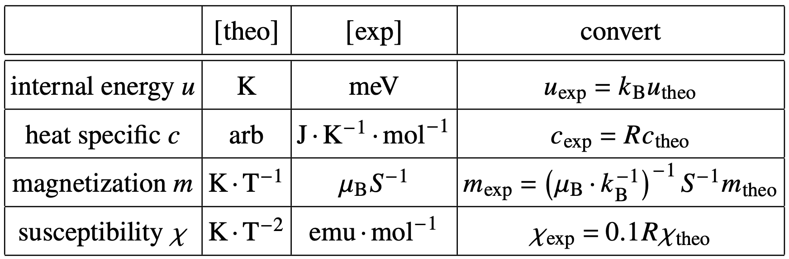

# ADCrystalField (automatic differentiation crystal field theory)

Using automatic differentiation (AD) to
- solve the system (including the energy levels and wave functions)
- calculate energy, specific heat, magnetization and susceptibility
- fit crystal field theory (CFT) parameters $B[l, m]$ with both specific heat and susceptibility experimental data

# Usage
Shown in `main_fit.ipynb`, the key step is that define a `FitModel` with a function `build_CEFparam(a)` to build the $B[l,m]$ list, this function is a map from the actual parameters $a$ to $B[l,m]$:

Note that in the example jupyter
- Before fit, a symmetry analysis is needed for lattice, and consider which CFT parameters are valid
- Only $l\leq 2s$ is valid, otherwise, steven operators $\mathcal{O}[l, m]$ are identically zeros for all $m$

## examples

- `main_fit_c.ipynb`
  - only fit with heat specific data to find CEF parameters
  - with fitted CEF parameters, fit $\lambda$ and $\chi_{0}$ with susceptibility data

- `main_fit_cchi.ipynb`
  - fit with heat specific and susceptibility data at the same time to find CEF parameters, $\lambda$ and $\chi_{0}$

## unit
the code use the unit as follows:

a reference for the unit convert:
- $1 k_{{\rm B}}=0.0861733186{\rm meV}\cdot{\rm K}^{-1}$
- $1 k_{{\rm B}}=1.380649\times10^{-23}\ {\rm J}\cdot{\rm K}^{-1}$
- $1 R=8.31446261815324{\rm J}\cdot{\rm K}^{-1}\cdot{\rm mol}^{-1}$
- $1 \mu_{{\rm B}}\cdot k_{{\rm B}}^{-1}=0.6717138148\ {\rm K}\cdot{\rm T}^{-1}$
- $N_{{\rm A}}=6.022\times10^{23}~{\rm mol}^{-1}$
- $1\ {\rm Oe}=10^{-4}\ {\rm T}$

# Derivation
The Hamiltonian can be written as
$$\mathcal{H}=B_{l}^{m}\mathcal{O}_{l}^{m}-\bm{H}\bm{S}$$

where $\bm{H} = g\mu_{B}\bm{B}$ 

solve the system, the energies are $E_{i}$.

The partition function can be written as

$$Z =\left(Z_{0}\right)^{N}=\left(\sum_{i}e^{-\beta E_{i}}\right)^{N}$$

The energy and specific heat can be obtained by `autograd` in computation.

$$u=-\frac{1}{N}\frac{\partial\ln Z}{\partial\beta}=-\frac{\partial\ln Z_{0}}{\partial\beta}$$

$$c=\frac{\partial u}{\partial T}=k_{B}\beta^{2}\frac{\partial^{2}\ln Z_{0}}{\partial\beta^{2}}$$

$$m=\frac{1}{\beta}\frac{\partial\ln Z}{\partial B}$$

$$\chi=\frac{1}{\beta}\frac{\partial^{2}\ln Z}{\partial B^{2}}$$

Moreover, consider the effective magnetic susceptibility:

$$\chi_{{\rm eff}}=\frac{\chi\left(T\right)}{1-\lambda\chi\left(T\right)}+\chi_{0}$$
